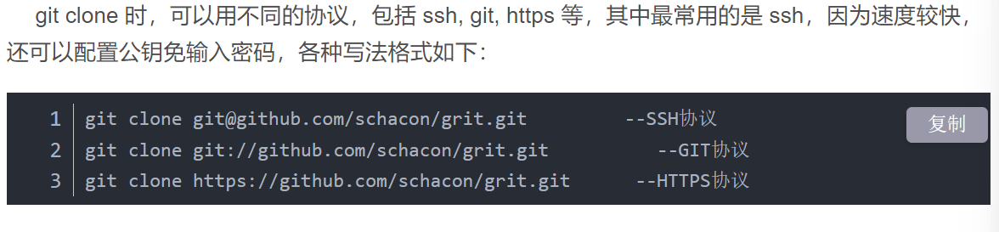
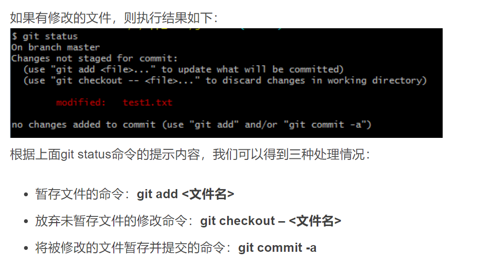
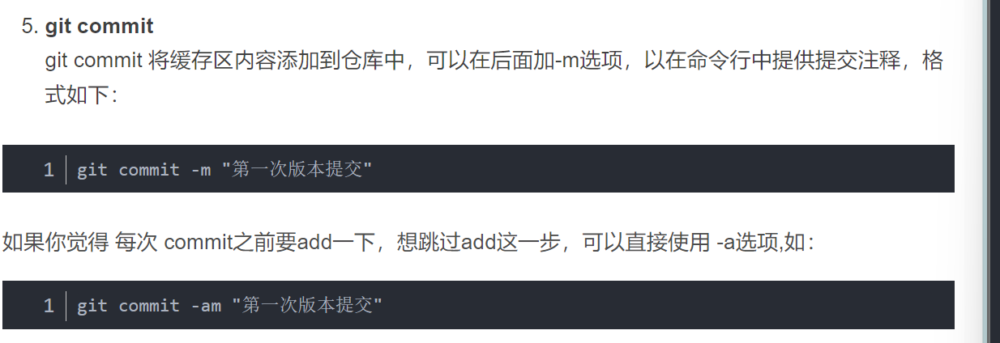
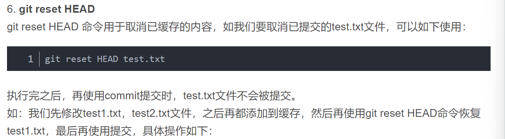
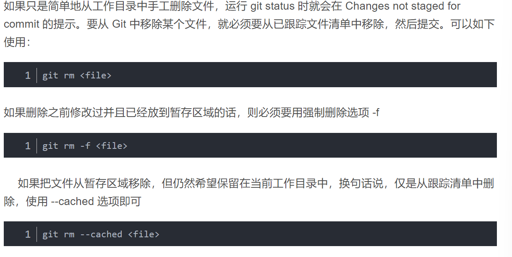

# GIT 常用指令大全
1. 创建仓库
   1. 创建新仓库：git init（执行该命令后会在当前目录下生成.init文件夹，并默认生成一个master或者main分支）
   2. 克隆仓库： git clone <url>[directory]
   
2. git config用于配置环境
3. git add  <file>将文件添加到缓存中
4. git status 用于查看相关文件的状态
   
5. git diff 用于查看更新的详细信息
   
6. git commit 将缓存区内容添加到仓库中
   
7. git reset HEAD <file>:取消已经缓存的内容
   
8. git rm <file>：删除某个文件
   
9. git mv <file> <newname>:用于移动或者重命名一个文件
    

   